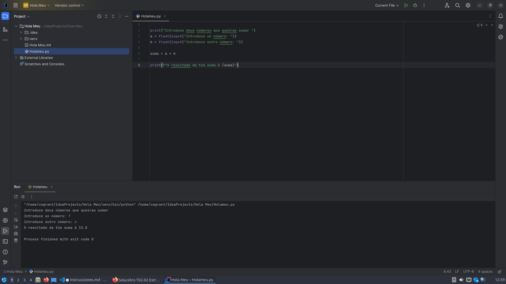

# Instalación de un IDE

Mi elección ha sido IntelliJ IDEA porque parece un IDE muy popular actualmente, y me interesa probar como funciona.

Es muy usado en entornos de desarrollo web, por lo tanto me parece idóneo para seguir formandome.

## Instalación IntelliJ 

1. Para introducirme como super usuario
    >sudo su  
1. Buscar el IDE con el comando snap
    
    > snap find "intellij"
1. Instalar la versión que buscamos
    >sudo snap install intellij-idea-community --classic 
1. Abrir dende terminal o programa
    >intellij-idea-community

5. Instalar a extensión de python para crear o meu programa 

## Programa

Aquí una captura de mi programa hecho con Python, es una calculadora que suma 2 valores que el usuario introduce. 

[Mi repositorio](https://github.com/DavidOteros/CD2024)
